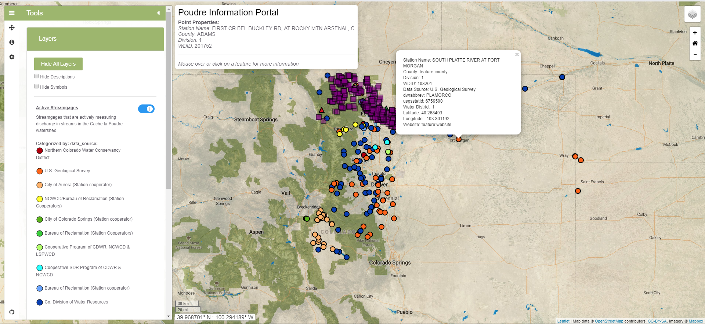

# Map Component

This component contains the files, and sub components that this component depends on for creating the map page within the site, accessible through the navigation bar. 

In this folder:

```
├── map-components
|   ├── animation-tools/ ............. Animation tools component (under development)
|   ├── background-layer-control/ .... Layer component for the background layer controls in the legend.
|   ├── legend-symbols/............... Symbols component for adding layer symbol descriptions in the legend under the layer controls. 
|   ├── map-error/ ................... Map error page displayed when map configuration file is not propertly read.
|   ├── map-layer-control/ ........... Layer component for the layers on top of the map.
|   ├── sidepanel-info/ .............. Sidepanel info component for the info tab in the sidebar.
|   ├── map.components.css ........... Stylesheet for map component.
|   ├── map.component.html ........... HTML template for map component.
|   ├── map.component.spec.ts ........ Testing file for map component.
|   ├── map.component.ts ............. Typescript file for map component.
|   ├── map.service.ts ............... A service file with helper functions for used in the map component.
|   ├── README.md .................... This file.
```


This component depends on the following components:

* ~~[AnimationToolsComponent](animation-tools/README.md)~~ - Still under development.
* [BackgroundLayerComponent](background-layer-control/README.md)
* [Legend Symbols](legend-symbols/README.md)
* [MapErrorComponent](map-error/README.md)
* [MapLayerComponet](map-layer-control/README.md)
* [SidePanelInfoComponent](sidepanel-info/README.md)

#### About Map Component File ####

The map component contains the majority of the code within the Angular application. The intent of this site is to dynamically load map data using configuration files and leaflet tools.

In `map.component.ts` there is a large amount of code that utilizes leaflet which creates the individual map loaded when clicking on a map link from the navigation bar.

To learn more about developing using Leaflet view the Leaflet documentation [here](<https://leafletjs.com/reference-1.5.0.html>).



## Sidebar

The sidebar is based on an adapted version of the Turbo87 leaflet-sidebar, available on Github at [https://github.com/Turbo87/leaflet-sidebar](https://github.com/Turbo87/leaflet-sidebar).  The leaflet-sidebar-v2 library has been downloaded via `npm` and saved in the `node_modules` folder. The sidebar allows functionality to see more data relevant to the map as well as control layers displayed on the map.

The sidebar contains the following functionality:

**Layers**:

- Ability to display or not display different individual data layers.
- Ability to display or not display all data layers.
- Title of each layer as specified in configuration file.
- Short description of each data layer.
- Symbol descriptions and explanations, including shape, colors, colorization method.
- Ability to show/hide descriptions
- Ability to show/hide symbol explanations.

**Basemap Layers**:

- Radio controls to select which base layer to display.